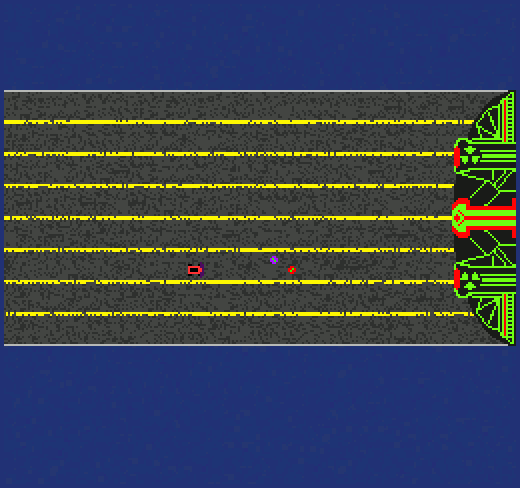

# Mothership: Return to Sender

Author: Henry Du

Design: This game is simple top-down side-scroller where you try to reflect some projectiles back to the enemy while avoid all other ones. Since this game is mainly an exercise in the asset pipeline, most of the focus was placed on using a complex background (a multi-lane road over an ocean), using multi-tile sprites (bombs and explosions are animated by using a couple of tiles as frames), and using mutli-sprite structure (the enemy mothership contains 56 sprites).

Screen Shot:

How Your Asset Pipeline Works:

1. Pixel art images were authored by hand using GIMP 2.10.12. Prior to export, all images were converted to Indexed Color format to ensure palette restriction adherence and converted back to RGBA to preserve an alpha channel. For that reason, each image contains all tiles sharing a palette. PNGs and XCFs have been checked in for each of these "tile set" images.

2. A python script `pack-tiles.py` is used to convert the RGBA data in the PNGs into a CSV format similar to what PPU466 uses. The first four lines are the RGBA of the 4 palette colors. The following lines are 16-element arrays of 8-bit unsigned integers, made up of `Tile.bit0` followed by `Tile.bit1`.

3. Loading of the CSVs in C++ code occurs in `TileSet.cpp`. As suggested, `Load< TileSet >` has been used to encapsulate the loading process. Each `TileSet` object contains the shared palette of the "tile set" and all tiles in the "tile set".

4. In the constructor of `PlayMode`, palettes and tiles are loaded into the PPU466 and the background is also mapped. Sprite are mapped when drawing occurs. This was a measure to dynamically add and remove sprites, as the 64-sprite limitation coupled with a 56-spite mothership enemy made sprites a scarce resource.

How To Play:

The controls are the arrows keys, and the objective is to reflect the purple colored bombs by running into them while avoiding all other projectiles. The player has 10 hitpoints and take 1 point of damage for each projectile hit, excluding the purple bombs. If the player takes damage, the player gains a brief period of invulnerability durign which all projectiles will pass through the player.

Currently, the game does not end no matter how much damage you take or how much damage you deal due to time contraints and for demo purposes.

This game was built with [NEST](NEST.md).

